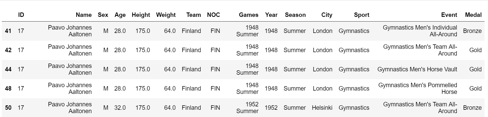

# DSCI_522_OlympicMedalPrediction
This analysis seeks to predict the medal count of each country for the 2020 Summer Olympics

### Title: Olympic Medal Prediction
Authors: Sayanti & Aaron  
Date: 2018-11-15

#### Question
Question type: Predictive  
What are strong predictors to estimate the medal count of the Summer Olympics for all participating countries? 

#### Thought.
We believe sport is one of the best way which unite a country and this is the sole purpose of the modern Olympic Games which promotes peace and unity within the international community through the medium of sports. The idea of this project occured when we tried to use athlete profile in machine learning context to measure their performance . However , we realised performance measurement of athlete has direct impact in number of medals a country wins for specific sports. Eventually , our interest in predicting next Summer Olympic medal count inspired us for this analysis.

#### Dataset
The dataset includes 120 years of olympic history and was composed by Randi H Griffin and updated as of 2018-06-15.
It can be found on [kaggle - athlete_events.csv](https://www.kaggle.com/heesoo37/120-years-of-olympic-history-athletes-and-results).

We have also taken into account population of each country , as more number of participants from a country enhances the probability of medal count . 

#### Glimpse of raw data 

#### Dependencies 

R , Python

#### Plan of Action

Data :  
Our data has  country , sport , medal win , event in which they participitated . As we want to achieve the total medal(Gold, Silver, Bronze) count for each country ; our target is medal count (Gold, Silver,Bronze) . We will wrangle the data and add population from the ??? dataset for each country . Also we will clean the data with wrong country names , duplicate records. As one of our feature is string we will convert it to integer to fit our model.

Analysis:  
As the prediction target is numerical so we will analyze the data using regression with a decision tree. We will extrapolate few information to make our feature for the model , like which countries has advantage of playing in home ground. We will check if the host city and team belongs from the same country . As population has direct impact on number of participants from each country whcih we believe will have significant effect on number of medals won by the country . We engineered the population data of each country and added it as feature.
 
Our features are : country, population , home ground advantage .
Our target are   : Total gold count , total silver count , total bronze count.

As we have three targets we will split the data to train vs test in 80-20 ratio and fit thrice for each target and predict thrice on the splitted test data for three target. Finally , we will merge the prediction to form the final prediction chart for each country with Gold, Silver , Bronze and total medal count . 

As we are targeting 2020 Summer Olymipic our data will be filtered with Summer season only . 

The results will be summarized in a table with country, gold, silver, bronze and total as column headers. The specific country and medal count values will be tabulated in each row. Additionaly this can be visualized with a columnn plot to compare country medal counts. 

#### Limitation

1. It does not consider the lag of past years .
2. The prediction model needs improvement for estimating more accurately.

