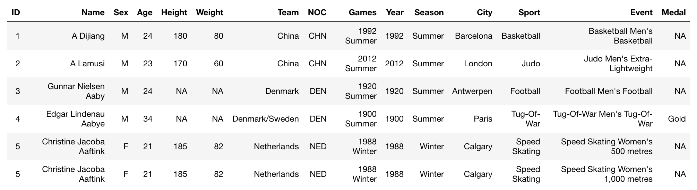
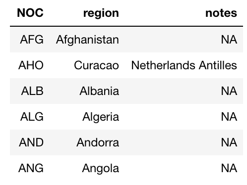
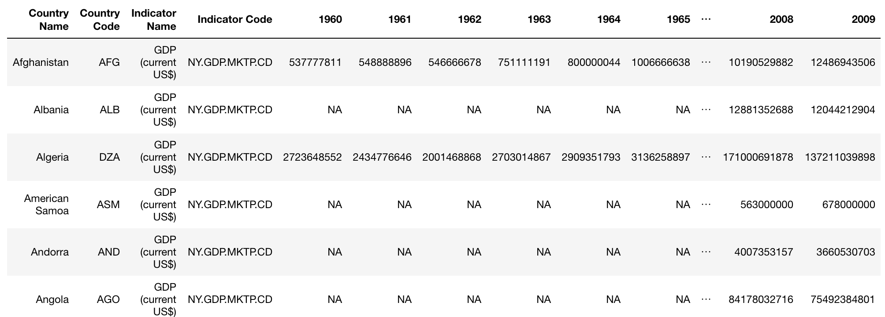
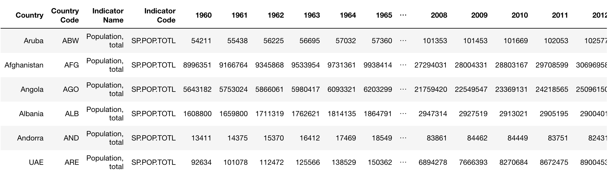
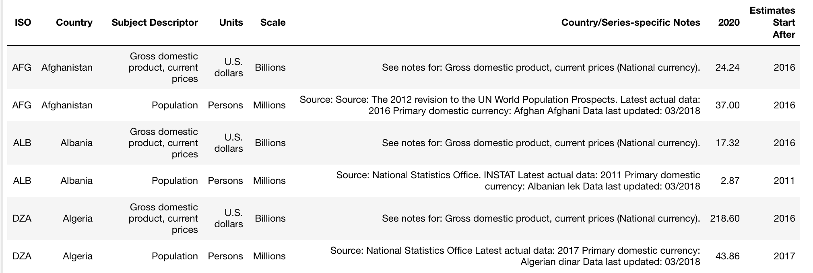

# Summary of Datasets

**athlete_events.csv:**   
Observations: 271,116  
Variables: 15

   

**noc_regions.csv**  
Observations: 230  
Variables: 3  

 

**w_gdp.csv**  
Observations: 219  
Variables: 62  

 

**WorldPopulation.csv**  
Observations: 217  
Variables: 62  

   

**WEO_2020_gdp_pop_outlook.csv**  
Observations: 388  
Variables: 8  

